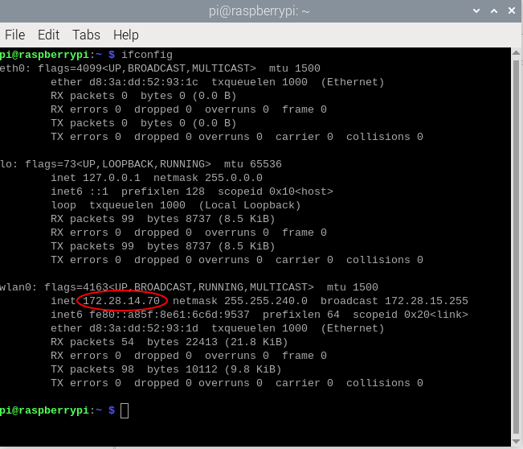
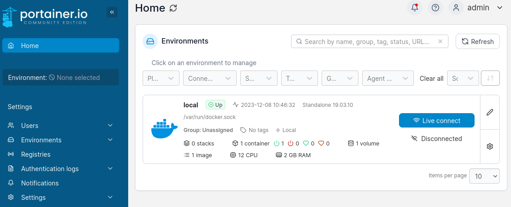
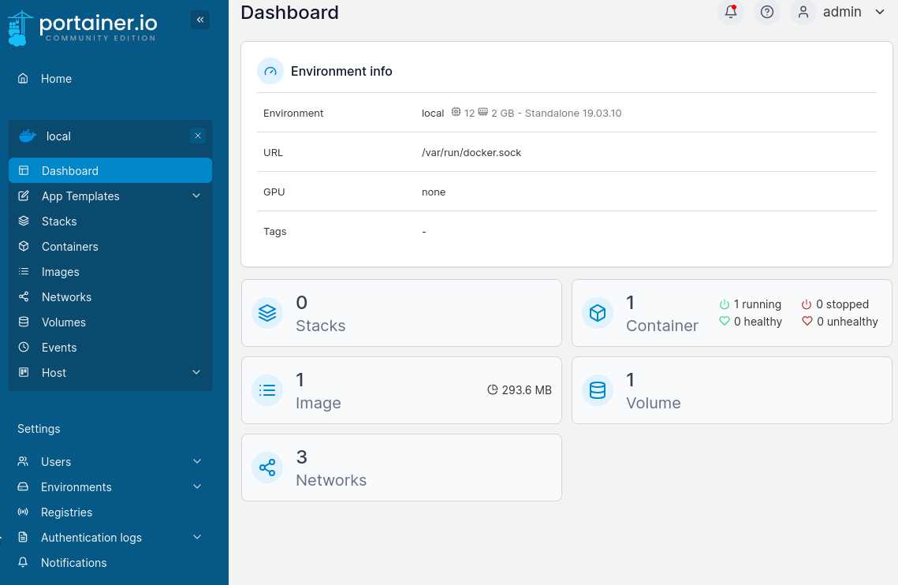
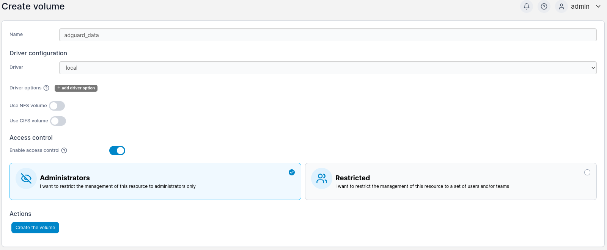
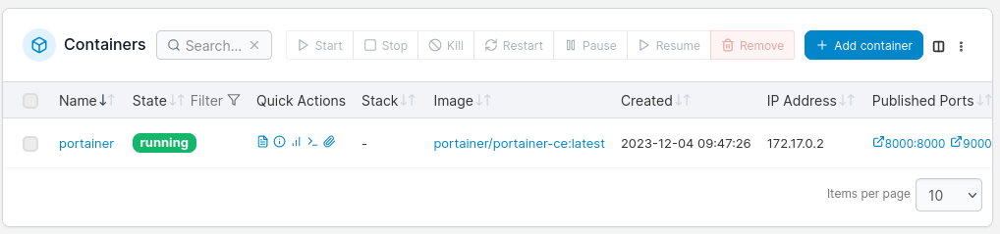
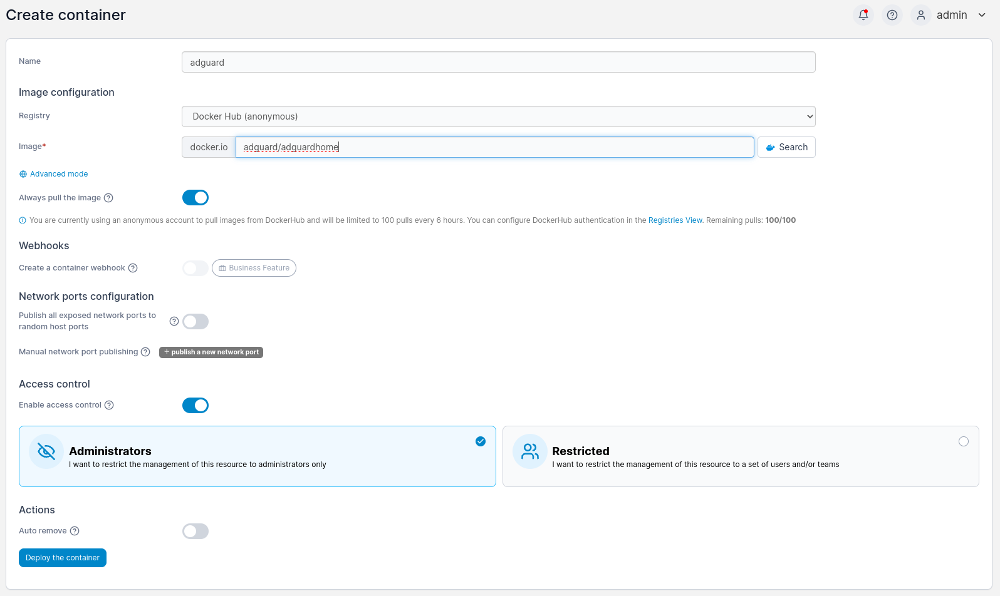
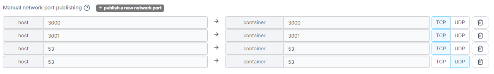
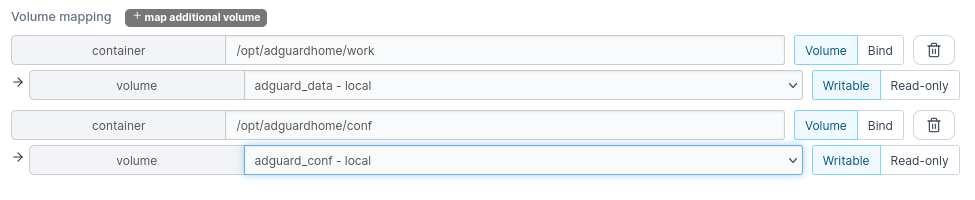

# Container - Isolation von Anwendungen

```csharp
if (readDocuments.ContainsAll({
    "Einleitungsdokument",
    "RaspberryPi",
    "Webserver"
    "AdGuard Home",
})) {
    continue;
} else {
    return;
}
```

## Inhaltsverzeichnis

1. [Einführung in die Virtualisierung](#einführung-in-die-virtualisierung)
2. [Inhalt dieses Dokuments](#inhalt-dieses-dokuments)
3. [Einführung in Docker](#einführung-in-docker)
4. [Docker-Setup](#docker-setup)
    - [Docker](#docker)
    - [Portainer](#portainer)
    - [Erstellen eines AdGuard-Containers](#erstellen-eines-adguard-containers)
    - [Erstellen eines nginx-Containers](#erstellen-eines-nginx-containers)

## Einleitung
In den bisherigen Anleitungen hast du erfahren, wie man einen [Webserver](../Webserver/) bzw. [AdGuard Home](<../AdGuard Home/>) auf [Raspberry Pi](<../Raspberry Pi/>) OS aufsetzt.  
Dieser Leitfaden baut auf diesem Wissen auf und zeigt dir, wie du diese Anwendungen auf dem gleichen System, aber voneinander isoliert, aufsetzen kannst. 


## Einführung in die Virtualisierung

Möchte man mehrere Services, wie beispielsweise einen Webserver und AdGuard gleichzeitig laufen lassen, hat man verschiedene Möglichkeiten:


### a) Alles auf einem Server

Es ist möglich mehrere Anwendungen auf einem Server laufen zu lassen. Diese Praxis weist jedoch eine sehr geringe Ausfallsicherheit auf. Wenn ein Service ein Problem verursacht, das beispielsweise das System zum Abstürzen bringt, fallen alle auf dem Rechner laufenden Programme aus, anstatt nur das betroffene. Deshalb sollte man diesen Ansatz im professionellen Umfeld vermeiden.


### b) Mehrere physische Server

Man kann sich mehrere physisch voneinander getrennte Rechner kaufen, die jeweils einen einzelnen Service hosten.
Diese Lösung ist aber heutzutage in vielen Fällen nicht wirtschaftlich, da man sich für viel Geld zwei Server kaufen muss. Außerdem benötigen sie zusammen sehr viel Strom.


### c) Virtuelle Maschinen

Alternativ kann man auch mehrere virtuelle Maschinen (VMs) auf einem Rechner aufsetzen, auf denen jeweils ein Service läuft.
Bei virtuellen Maschinen wird eine vom Hostsystem unabhängige Hardware- / Softwareumgebung emuliert (der Software wird vorgegaukelt, dass eine spezifische Hardware vorhanden ist; mit Emulatoren kann man beispielsweise Android-Apps auf Windows ausführen). Das Ergebnis ist ein virtueller Computer, der völlig vom Hauptsystem abgekoppelt (isoliert) ist. 

Fällt eine der virtuellen Maschinen aus, dann sind andere VMs meist nicht betroffen und können ohne Unterbrechung weiterarbeiten.

Der Nachteil bei VMs ist jedoch, dass sehr viel Rechenleistung benötigt wird, weil mehrere Betriebssystem-Kernels parallel laufen. Man muss sich also sehr starke Hardware kaufen, um Services auf einem Server jeweils in einer eigenen VM laufen zu lassen.
Trotzdem haben sie auch ihre Anwendungsfälle.


### d) Containerisierung

Der geeignetere Lösungsansatz ist in vielen Fällen die Verwendung von Containern.

Container sind ähnlich wie VMs, jedoch benötigen sie zum Laufen kein eigenes Betriebssystem/Kernel. Es muss also keine neue Hardwareumgebung emuliert werden, sondern es können einfach die Umgebung / Bibliotheken des Hostsystems verwendet werden. Somit wird viel Rechenleistung gespart.
Generell sind Container von der Hostmaschine isoliert, es können aber auch bestimmte Schnittstellen, wie beispielsweise Ordner, festgelegt werden, über die mit ihnen kommuniziert werden kann.

Zusätzlich gibt es bei Containern keine Bindung an bestimmte Betriebssysteme. Läuft ein Container auf Linux, läuft er auch ohne Probleme auf Windows oder MacOS. Im Internet gibt es viele bereits vorgefertigte Container, die verwendet werden können. So lässt sich zum Beispiel sehr einfach und schnell ein Webserver aufsetzen (siehe weiter unten).

Hier muss angemerkt werden, dass Container nicht immer die beste Lösung sind.


## Inhalt dieses Dokuments

Es gibt viele Technologien, die Containerisierung ermöglichen. In diesem Beispiel wird [Docker](https://docs.docker.com/get-started/overview/) verwendet, da es das am weitesten verbreitete System für Containerisierung ist. Mit Docker kann man in wenigen Schritten Anwendungen herunterladen und starten. 

Docker kann auf vielen Betriebssystemen verwendet werden. Da in dieser Übung ein Raspberry Pi verwendet wird, bietet sich Raspberry Pi OS an.

In dieser Anleitung lernst du, ...

- was Docker ist und wie es funktioniert,
- wie man Portainer zur Containerverwaltung verwendet und
- wie man die in den anderen Anleitungen erklärten Services in Containern laufen lässt (einen Webserver und AdGuard)

Für diese Anleitung bietet es sich an, Raspberry Pi OS neu zu installieren, da es sonst zu Konflikten mit bereits installierten Programmen kommen kann.

## Einführung in Docker

### Images

Docker-Images sind Anweisungen, um einen Docker Container zu erstellen. Man kann Images von anderen Entwicklern verwenden oder selbst welche schreiben. Für die Erstellung eines eigenen Images wird ein Dockerfile verwendet, das die Anweisungen festlegt, die Docker beim Erstellen des Containers abarbeitet. 

Images sind betriebssystemunabhängig, können also auf jedem PC, auf dem Docker läuft, verwendet werden.


### Container

Container sind eine ausführbare Instanz eines Images. Bei ihrer Erstellung hat man viele Konfigurationsoptionen zur Auswahl. Beispielsweise kann man Ports des Hostsystems an den Container weiterleiten (*publishen*) und Volumes zum persistenten Speichern von Daten einbinden.
Wie bereits oben beschrieben wurde, bietet ein Container viele Vorteile, wie die Isolation von anderen Anwendungen und Ressourcen, die ihm nicht zugewiesen sind.


### Volumes

Manche Container benötigen *persistenten* Speicher (also Speicher, der beim Herunterfahren des Rechners nicht verloren geht). Um dies zu gewährleisten, gibt es die sog. [*Volumes*](https://docs.docker.com/storage/volumes/). 

Volumes sind Speicherorte, die von Docker verwaltet werden und sich außerhalb des Host-Dateisystems befinden. Um sie zu verwenden kann man sie  Containern bei ihrer Erstellung zuweisen, die sie dann zum dauerhaften Speichern von Daten verwenden können. Ohne diese Zuweisung kann kein Container auf die Volumes zugreifen.

Die Isolation von Volumes sorgt dafür, dass kein anderer Prozess die Dateien, die der Container benötigt, verwenden / bearbeiten kann. 

Neben den herkömmlichen Volumes gibt es bei Docker noch die sog. bind-Mounts. Anstatt Docker die Verantwortung für den Speicher zu übertragen, übergibt man Containern einfach einen Ordner auf seinem Host-System, in dem dieser dann arbeitet. 


## Docker-Setup

In diesem Kapitel findest du eine Schritt-für-Schritt-Anleitung zum Aufsetzen eines funktionsfähigen Container-System mit Portainer, Webserver und AdGuard auf dem Raspberry Pi.


### Docker

Um auf dem Raspberry Pi Docker zu installieren gibst du im Terminal einfach folgenden Befehl ein:

```bash
curl -sSL https://get.docker.com | sh
```


### Portainer

Zur Interaktion mit Docker verwendet man oft das Command Line Interface (**CLI**).
Um auf diese Weise Container verwalten zu können, muss man sich also viele Befehle merken.

Um die Benutzung zu vereinfachen, gibt es eine Alternative, die es ermöglicht, Container durch eine grafische Benutzeroberfläche im Browser zu verwalten: ***Portainer***. 
Mit Portainer kann man Images herunterladen, Volumes verwalten, Container erstellen, starten und stoppen und vieles mehr. Der Vorteil ist, dass man viele Einstellungsmöglichkeiten vorgeschlagen bekommt und nicht vorher wissen muss, dass sie existieren.

Portainer ist selbst ein Docker-Container und muss also erst über das Terminal installiert werden. Wie das geht, findest du in den folgenden Absätzen.

#### Schritt 1: Erstellen eines Volumes

Portainer benötigt ein eigenes Volume, da dort beispielsweise die Anmeldedaten für Benutzer abgelegt werden. Um bei Docker ein Volume für Portainer zu erstellen, benötigt man den folgenden Befehl:

```bash
sudo docker volume create portainer_data
```

`portainer_data` ist der Name des Volumes.


#### Schritt 2: Erstellen des Portainer-Containers

Mit dem folgenden Befehl wird ein Container mit dem aktuellsten Portainer(Community Edition)-Image erstellt und automatisch gestartet:

```bash
sudo docker run -d -p 8000:8000 -p 9000:9000 --name portainer --restart=always -v /var/run/docker.sock:/var/run/docker.sock -v portainer_data:/data portainer/portainer-ce:latest
```

Nun zur Erklärung der einzelnen Bestandteile:
- `docker run` ist die Kombination aus den Befehlen `docker create` und `docker start`. 
    - `docker create` erstellt einen Container und kümmert sich um das Mounten von Volumes und die Port-Weiterleitungen.
    - `docker start` startet nicht-laufende Container.

- Die `-d` Flag (detached) sorgt dafür, dass der Container im Hintergrund gestartet wird und nicht mehr mit der Command Line interagiert.
- Die `-p` Flag (publish) steht bei Docker für die Weiterleitung der Ports des Hostsystems auf die des Containers. In diesem Beispiel wird Port 9000 des Hostsystems auf Port 9000 des Containers geleitet. Es wird also jede Anfrage, die beim Hostsystem auf Port 9000 ankommt, an den Container auf den anderen Port (hier auch 9000) weitergegeben. Das gleiche passiert auch für Port 8000.
- Die `--name` Flag weist dem Container einen Namen zu (in diesem Fall "portainer").
- Die `--restart=always` Flag sagt Docker, dass der Container automatisch gestartet werden soll, wenn er gerade nicht läuft.
- Die `-v` Flag gibt dem Container Zugriff auf von dir erstellte Volumes. In diesem Fall bindest du einerseits dein eben erstelltes Volume ein, das alle Daten von Portainer speichert (Zugangsdaten, Konfiguration, etc.), und eines, das es ihm ermöglicht, Docker auf dem Raspberry Pi zu verwalten ("/var/run/docker.sock").
- Das letzte Argument des Befehls, `portainer/portainer-ce:latest`, gibt das Image an, das Docker verwenden soll. Da du es noch nicht selbst installiert hast, installiert Docker es automatisch aus dem Internet auf deinen Rechner.

Mit dem Befehl `sudo docker ps` kann man hinterher überprüfen, ob der Container auch wirklich läuft.

Portainer startet einen HTTP-Server auf Port 9000, weshalb er in diesem Schritt auch gepublisht wird. Über diesen Port kannst du im Browser das Portainer Control Panel aufrufen.

Weitere Informationen über Docker und wie man es verwenden kann findest du [hier](https://docs.docker.com/get-started/).


#### Schritt 3: IP-Adresse herausfinden

Es gibt zwei einfache Möglichkeiten, wie du die IP-Adresse deines Raspberry Pis herausfinden kannst:  
1. Über das Webinterface deines WLAN-Routers (bei Fritzboxen von AVM beispielsweise über die Adresse `fritz.box` im Browser)
2. Über den `ifconfig` Befehl in der Konsole. (Alternativ auch `hostname -I`)




#### Schritt 4: Mit Portainer verbinden

Im letzten Schritt kannst du von einem PC aus auf Portainer zugreifen.
Dies erreichst du, indem du Folgendes in die Suchleiste deines Browsers eingibst:

```
http://<ip-address>:9000
```


#### Schritt 5: Verwenden

Nun musst du nur noch einen Benutzer erstellen, mit dem du dich anmelden kannst.

Wenn alles funktioniert hat, kannst du die Portainer-Übersicht sehen:



Nun musst du nur noch einmal auf local klicken und du erreichst die Containerverwaltung.




### Erstellen eines AdGuard Home-Containers

AdGuard Home benötigt zwei Volumes: ein Data-Volume und ein Config-Volume.
Diese kannst du im Volume-Tab erstellen.
In diesem Beispiel werden sie `adguard_data` und `adguard_conf` genannt.



Das Bild zeigt die Konfiguration des `adguard_data` Volumes. Das andere wird genauso erstellt.

Nun kannst du den Container erstellen.
Hierzu gehst du auf die Container-Seite:



Hier klickst du auf "Add Container".

Auf der Seite, die sich öffnet, kannst du verschiedene Einstellungen vornehmen. Es sind dieselben Einstellungen, die du beim Aufsetzen von Portainer in der Konsole verwendet hast, nur dass sie hier grafisch dargestellt werden.

Der Name des Containers ist frei wählbar. In diesem Beispiel wird "*adguard*" verwendet.
Bei Image trägst du "*adguard/adguardhome*" ein.



Unter "Network ports configuration" kannst du manuell Ports "publishen". 
AdGuard Home benötigt die Ports 80, 53 und 3000.

Da im weiteren Verlauf aber noch ein Webserver eingebunden werden soll, der Port 80 verwendet, musst du die Zuweisung anpassen.
Statt Port 80 kannst du also einfach Port 3001 verwenden.

Gepublisht werden müssen also 3001:3001/tcp, 53:53/tcp, 53:53/udp und 3000:3000/tcp:




Unter `Advanced container settings` -> `Volumes` kannst du die Volumes einbinden.



Zu guter Letzt kannst du unter `Advanced container settings` -> `Restart policy` "Always" einstellen, damit dein Container immer läuft.

Jetzt kannst du auf `Deploy the container` drücken und dein Container wird automatisch erstellt und gestartet.

Die Einrichtung erfolgt wie in der dedizierten [AdGuard Home](<../AdGuard Home>)-Anleitung.
Achte nur darauf, dass du auf der Konfigurationsseite 2 bei der Auswahl des Ports, auf dem das Admin Web Interface laufen soll, Port 3001 angibst, da das der Port ist, den du vorher gepublisht hast.

### Erstellen eines nginx-Containers

Das Erstellen des nginx-Containers läuft sehr ähnlich ab, wie das Erstellen des AdGuard-Containers, weshalb hier auf Bilder verzichtet wird.

Das Image heißt `nginx`.
Der Port, der gepublisht werden muss, ist 80:80/tcp.

Bei nginx bietet sich ein bind-Mount an, da man die Website-Dateien dann leicht live bearbeiten kann. Hierzu wählst du unter `Advanced container settings` -> `Volume` bei der Erstellung des Containers statt `Volume` die Option `Bind` aus und trägst einen Ordner ein, der auf dem Host-System liegt (beispielsweise `/var/www`). Es kann sein, dass du den Ordner erst noch erstellen musst.
Der Webseiten-Ordner im Container heißt bei nginx `/usr/share/nginx/html`
(Beim Host also "/var/www" eintragen und beim Container "/usr/share/nginx/html").

Falls nginx nicht die Rechte besitzt, um die Dateien im freigegebenen Ordner zu lesen / auszuführen, musst du die Zugriffsrechte des Ordners (und aller darunterliegenden Dateien) ändern. Das erreichst du mit dem Befehl `sudo chmod -R 755 /var/www`.

Fügst du nun eine index.html-Datei in den Ordner ein, kannst du, wenn du die IP des Raspberry Pis in den Browser eingegeben hast (mit http:// davor), deine Website sehen.


## Abschluss

Nun hast du das Ende der Containerisierungs-Anleitung erreicht. 
Du bist jetzt in der Lage auf Linux-PCs mehrere logisch voneinander getrenne Programme laufen zu lassen.

Wenn du das Projekt noch etwas weiter führen möchtest, kannst du dir im dem Internet weitere interessant klingende Docker-Images heraussuchen und mit Portainer Container daraus erstellen. Möchtest du es dir etwas schwerer machen, kannst du es auch über die Kommandozeile versuchen ;).
